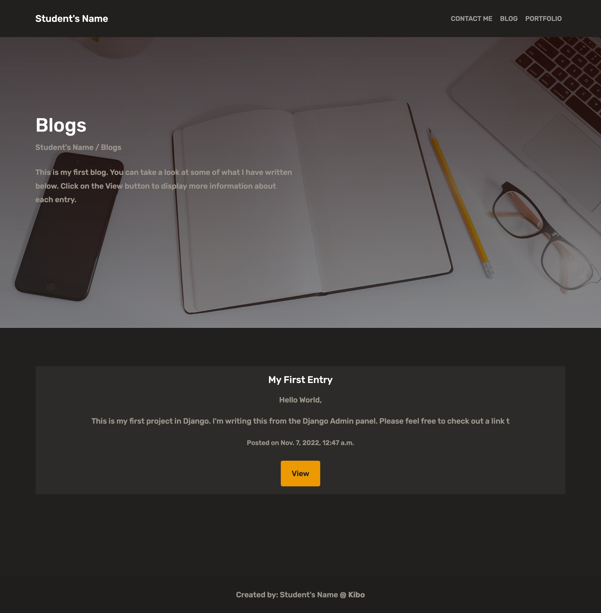
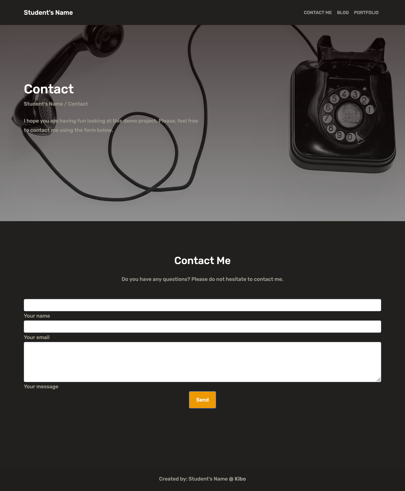
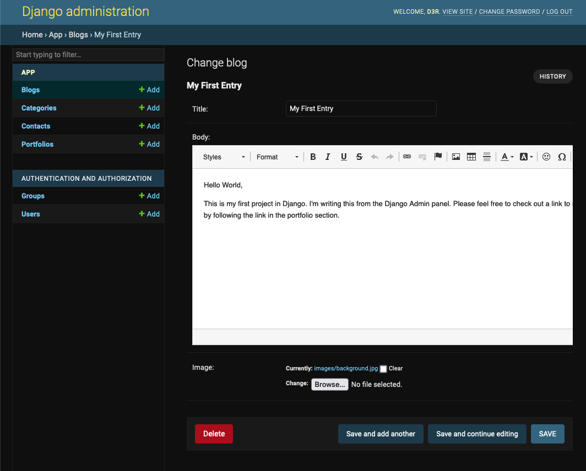
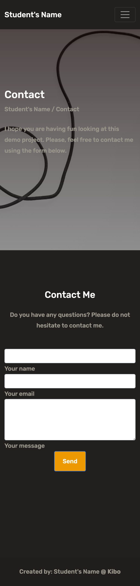

# Project: Personal site. Blog & Portfolio

In this project, you'll build your own personal site. Having a webpage in which you can showcase your work to others and write opinions on new topics is important.

Having a blog can make you a better programmer and will give you some time to reflect on your newly acquired skills.

## Your Task

You will create a django application to implement your website. The website will consist of three main sections.

- **Portfolio.**
  A portfolio section for you to show some of your previous projects. Projects should include an associated category and a thumbnail picture. On click on each item, more information will be displayed.

- **Blog.**
  A blog section. You should include a blog feed in which all post are displayed alongside the post date and brief summary. On clicking each item the complete post will be shown a new page.

- **Contact Me.**
  A contact form. This will allow people to contact you and ask you specific questions about your projects. The contact message, name, email and all the information from the form should be stored in the data base.

As your website is going to be viewed from both mobile and desktop devices **you should implement a responsive behavior.**

A working backend should also be implemented in order for the site to store blog posts, contact requests, and the categories for your project portfolio.

## Steps

In order to successfully deliver this project, please consider the following:

- Implement a responsive framework such as bootstrap.

- Generate all the necessary templates to implement all the views.

- Route the appropriate views to their url patterns.

- Generate the required models with their appropriate fields types.

## Starter Code

Please find the starter code for this project in the `django_blog` folder.

The provided code includes the necessary folder structure for a django app. However, you will need to initialize your own virtual environment using the `requirements.txt` file.

## Expected Results

You should submit working a Django Application. Use whatever style you prefer to implement your blog. Customize it with your own custom css and html.

This is the expected outcome for the **portfolio** view.

This is the expected outcome for the **blog** view.

This is the expected outcome for the **contact** view.

All of the CRUD operations will be performed using the provided Django Admin interface.

\*Every view should properly render at mobile and desktop versions.

## Hints

- Remember to generate your own super user before running the provided starter code.

  `python manage.py createsuperuser`

- Run any necessary migrations before running your server for the first time.

  Remember, you can run any existing migrations using:

  `python manage.py migrate`

- If you need any help on how to create your models, you can take a look at sample db_schema in the [img folder](/img/db_schema.png)

## Testing

You'll find tests to your models in the default folder for tests in Django: `app/tests.py`
